# De-identification Repository Landscape Review

日期：2026-05-12  
目的：greedy 搜尋並比較開源/官方 de-identification 相關專案，找出本專案上線前與下一階段可借鑑的設計。

## Executive Summary

本輪 review 以 3 條 subagent 並行搜尋，加上主線補充 benchmark/model/source review：

- 文字與臨床 NLP de-id：Presidio、Philter、PhysioNet deid、pyDeid、MIST、scrubadub、medspaCy、TiDE、CliniDeID、Transformer/ClinicalBERT 系列。
- 文件格式/OCR/影像/DICOM：OCRmyPDF、Tesseract、PyMuPDF、pdf-redactor、Docling、Tika、Dedoc、pydicom/deid、RSNA anonymizer、DICOMAnonymizer、dicompixelanon。
- Production service 架構：job queue、artifact store、audit log、RBAC、Docker/Kubernetes、cloud healthcare de-id API 的 job model。

最重要的結論：

1. 我們目前的方向正確：本地 LLM/規則混合、session/user isolation、格式保真 artifact、progress callback、前端 proxy 都是 production 必要基礎。
2. 最大缺口不是再多接一個 LLM，而是建立標準化 `DetectionResult + provenance + policy/operator + residual scan` 管線。
3. 格式保真輸出不能只靠文字替換。PDF/DOCX/DICOM/掃描件需要 asset inventory、座標級 span、metadata/embedded asset 清理與「紅action 後殘留掃描」。
4. production-grade 需要外部 queue/worker、DB-backed jobs/artifacts/audit logs、signed download、policy versioning、細粒度 RBAC。
5. 評測要從 smoke test 提升到 benchmark matrix：span-level precision/recall/F1、per-PHI-type metrics、多格式 residual leak tests、多使用者隔離與 worker crash tests。

## High-Value Repositories And Tools

### Clinical Text / PHI Detection

| 專案 | 類型 | 核心策略 | 可借鑑設計 |
| --- | --- | --- | --- |
| [Microsoft Presidio](https://github.com/microsoft/presidio) | 泛用 PII SDK/service | recognizer、regex、checksum、spaCy/transformers、自訂 anonymizer；支援 text、image、structured data、Docker/K8s | 抽象成 `Analyzer -> Span -> Operator`；plugin recognizer；explainability；多 backend |
| [Philter UCSF](https://github.com/BCHSI/philter-ucsf) | 臨床 note de-id | regex、lexicon、POS、statistical model、i2b2 XML output/eval | config-driven filters；i2b2/n2c2 adapter；evaluation CLI；clean-word/PHI filter map |
| [PhysioNet deid](https://physionet.org/content/deid/1.1/) | 經典 rule baseline | Perl、lookup dictionaries、surrogate replacement、date shift | 可稽核 rule baseline；date shift / surrogate replacement；benchmark 對照 |
| [pyDeid](https://github.com/GEMINI-Medicine/pyDeid) | Python rule-based clinical text | PhysioNet deid Python refactor；regex、lookup dict、custom namelists、optional spaCy NER | CSV workflow、site-specific regex/name lists、PHI sidecar、speed baseline |
| [MITRE MIST](https://mist-deid.sourceforge.net/) / [jCarafe](https://www.mitre.org/our-impact/intellectual-property/jcarafe-de-identification-medical-records) | trainable de-id toolkit | annotation workbench、ML model、surrogate replacement | 人工標註 -> 訓練 -> scorer 工作台；domain adaptation workflow |
| [scrubadub](https://github.com/LeapBeyond/scrubadub) | 泛用 PII scrubbing | Detector、Filth、PostProcessor、locale support | 簡潔 plugin API；post-processing；可用作非醫療 PII baseline |
| [medspaCy](https://github.com/medspacy/medspacy) | clinical NLP toolkit | clinical sentence split、section detection、ConText、rule NER | section-aware PHI detection；臨床句切；否定/歷史脈絡 |
| [Stanford TiDE](https://github.com/susom/tide) | clinical note de-id | known PHI tables、pattern matching、NER、Safe Harbor-oriented | 使用 patient/person CSV、MRN、院內人名/地址名單提高 recall |
| [CliniDeID](https://github.com/Clinacuity/CliniDeID) | clinical text GUI/CLI | HIPAA Safe Harbor、ML ensemble、realistic surrogates、多格式輸入 | GUI/CLI、known identifier double-check、record-level consistent surrogate |
| [Transformer-DeID](https://physionet.org/content/transformer-deid/1.0.0/) / [kind-lab/transformer-deid](https://github.com/kind-lab/transformer-deid) | transformer token classifier | BERT、DistilBERT、RoBERTa；standoff span format | token classification baseline；span offset dataset format；fine-tune harness |
| [OBI Robust DeID](https://github.com/obi-ml-public/ehr_deidentification) | transformer clinical de-id | RoBERTa/ClinicalBERT、recall-biased thresholding、clinical tokenizer | 「高召回安全模式」；sliding-window context；threshold tuning |
| [NLM Scrubber](https://lhncbc.nlm.nih.gov/scrubber/) | NLM clinical text de-id | HIPAA-oriented clinical reports | baseline comparator；文件化殘餘風險與使用者責任 |
| [CRATE](https://github.com/ucam-department-of-psychiatry/crate) | clinical database anonymisation | DB anonymisation、pseudonym mapping、research DB、audit | EHR dump/data warehouse 模式；linkage/pseudonym table；audit trail |
| [Deduce](https://github.com/vmenger/deduce) / [nedap/deidentify](https://github.com/nedap/deidentify) | Dutch clinical de-id | metadata-assisted rules、fuzzy matching、CRF/BiLSTM-CRF | 語言/地區 pack；patient metadata 輔助召回；統一 tagger interface |
| [Phileas](https://github.com/philterd/phileas) | policy-driven redaction | text/PDF、replace/encrypt/anonymize policy | JSON policy、條件式 redaction、consistent de-id |

### Format Preservation, OCR, PDF, Office Documents

| 專案 | 支援格式 | 重點 | 可借鑑設計 |
| --- | --- | --- | --- |
| [OCRmyPDF](https://github.com/ocrmypdf/OCRmyPDF) | scanned PDF | 產生 searchable PDF/A、deskew、rotate、Tesseract OCR | PDF OCR preflight；OCR provenance；PDF/A output |
| [Tesseract OCR](https://github.com/tesseract-ocr/tesseract) | images/scans | hOCR/TSV/PDF/ALTO/PAGE；word bbox/confidence | PHI span 對齊 bbox；confidence-aware human review |
| [PyMuPDF](https://github.com/pymupdf/PyMuPDF) | PDF/images | blocks/lines/spans/bbox、annotations、`apply_redactions()` | born-digital PDF 真 redaction；bbox-based annotation preview |
| [pdf-redactor](https://github.com/JoshData/pdf-redactor) | PDF text layer | content stream、annotations、links、metadata | PDF 非正文資產 inventory；metadata/annotation/link 清理 |
| [doc_redaction](https://github.com/seanpedrick-case/doc_redaction) | PDF/image/DOCX/XLSX/CSV/Parquet | GUI 審核、Tesseract/AWS Textract/PaddleOCR/VLM fallback | 人審 redaction workflow；多 extractor fallback；redaction review UI |
| [Docling](https://github.com/docling-project/docling) | PDF/DOCX/PPTX/XLSX/HTML/images | `DoclingDocument`、layout、tables、reading order、OCR/VLM | 統一 document IR；table/paragraph provenance |
| [MinerU](https://github.com/opendatalab/MinerU) | PDF/Office docs | native extraction + hybrid OCR/layout | 複雜醫療 PDF/table extraction 前處理 |
| [Apache Tika](https://github.com/apache/tika) / [CogStack tika-service](https://github.com/CogStack/tika-service) | 上千種 MIME | text + metadata extraction、OCR integration | MIME/metadata inventory service；parser provenance |
| [Dedoc](https://github.com/ispras/dedoc) | DOC/DOCX/XLS/XLSX/PDF/HTML/images/archive | document structure tree、tables、metadata | logical document tree；node path provenance |
| [MaskWise](https://github.com/bluewave-labs/maskwise) | Office/PDF/text/image/structured | format-preserving anonymization、audit、RBAC、policy | enterprise workflow；policy/audit/batch UI |
| [asset-aware-mcp](https://github.com/u9401066/asset-aware-mcp) | DFM/OCR/asset-aware workflows | agent-oriented heavy MCP | 可拆 DFM/OCR 子模組；本專案用 lazy adapter，避免重依賴綁死 |

### DICOM / Medical Imaging

| 專案 | 主要能力 | 可借鑑設計 |
| --- | --- | --- |
| [pydicom/deid](https://pydicom.github.io/deid/) | DICOM/image header/pixel basic de-id、recipes | DICOM recipe/rule concept；metadata tag policy |
| [RSNA/anonymizer](https://github.com/RSNA/anonymizer) | standalone DICOM anonymizer、export to DICOM server/S3 | incoming folder/network receiver -> de-id storage -> export |
| [mmiv-center/DICOMAnonymizer](https://github.com/mmiv-center/DICOMAnonymizer) | multi-threaded DICOM PS 3.15 Annex E | deterministic UID/patient mapping；threaded batch processing |
| [openradx/dicom-anonymizer](https://github.com/openradx/dicom-anonymizer) | TypeScript/browser DICOM anonymizer | browser-side DICOM anonymization；custom rules |
| [aces/DICAT](https://github.com/aces/DICAT) | lightweight GUI DICOM header anonymizer | simple local workstation UI；minimal dependency |
| [SMI/dicompixelanon](https://github.com/SMI/dicompixelanon) | DICOM pixel anonymisation | metadata de-id 與 burned-in pixel PHI 分離 pipeline |
| [code-lukas/medical_image_deidentification](https://github.com/code-lukas/medical_image_deidentification) | MRI/CT/WSI/twix raw data de-id | medical imaging multi-format thinking |

### Production Service / Architecture References

| 工具/服務 | 參考點 | 對本專案啟發 |
| --- | --- | --- |
| [AWS Comprehend Medical PHI async jobs](https://docs.aws.amazon.com/cli/latest/reference/comprehendmedical/start-phi-detection-job.html) | job id、S3 input/output、IAM/KMS | object storage、idempotency token、encrypted outputs |
| [Azure Health Data Services de-identification](https://learn.microsoft.com/en-us/azure/healthcare-apis/deidentification/overview) | TAG/REDACT/SURROGATE、sync/async endpoint | 明確 operation type；detect/redact/surrogate API model |
| [Google Cloud Healthcare API de-identification](https://docs.cloud.google.com/healthcare-api/docs/concepts/de-identification) | FHIR/DICOM store-level de-id、source/destination separation | source/destination store 分離，不覆寫原始資料 |
| [ARX](https://github.com/arx-deidentifier/arx) | k-anonymity、l-diversity、t-closeness、DP | structured table re-identification risk，不只 PHI masking |
| [Celery](https://github.com/celery/celery) / [Temporal](https://temporal.io/) | broker/result store、retry、durable workflows | 外部 worker queue、crash recovery、long-running workflow |
| [Argo Workflows](https://argoproj.github.io/workflows/) | Kubernetes-native DAG、artifact repository | k8s batch pipeline；parallel per-file/per-page nodes |

## What This Project Already Does Well

目前本專案已經具備一些上線前很重要的雛形：

- 本地/遠端 Ollama LLM path，避免預設把 PHI 丟到公有雲。
- session/user isolation、匿名 session 模式、password/RBAC 模式、frontend same-origin `/api` proxy。
- 處理任務有背景執行與 progress polling，且前端已可顯示進度。
- CSV/XLSX 格式保真 artifact 已修正，不再把 PHI audit list 當成去識別化原檔。
- raw upload 預設處理後清除，結果/報告有 TTL 設計。
- 已有 smoke workflow，且已補強 LAN/proxy/session upload 測試能力。

## Core Gaps Compared With Mature Systems

### 1. Detection Model Needs A Stable Span Contract

成熟工具的共同點不是「單一模型很強」，而是有穩定 span contract。

建議新增：

```python
DetectionResult(
    entity_type="NAME",
    text="...",
    start=123,
    end=126,
    confidence=0.94,
    source_engine="llm|regex|ocr|presidio|known_phi",
    provenance={
        "file_id": "...",
        "sheet": "Sheet1",
        "row": 3,
        "column": "姓名",
        "page": 2,
        "bbox": [x0, y0, x1, y1],
        "docx_part": "header/footer/body/comment",
    },
    evidence=["matched known patient name", "LLM span"],
)
```

這會讓 LLM、regex、OCR、Presidio、known-PHI table 都能合併，而不是各自回傳不同格式。

### 2. Redaction Should Be Policy/Operator Driven

參考 Presidio、Phileas、Azure 的 operation model，建議把遮罩策略版本化：

```yaml
policy_version: "tw-hospital-safeharbor-v1"
operators:
  NAME: redact
  MEDICAL_RECORD_NUMBER: hash
  DATE: date_shift
  AGE_OVER_89: generalize
  LOCATION: region_generalize
fallback_operator: redact
```

每次 job 要記錄：

- policy version
- PHI type set
- model version
- prompt hash
- recognizer versions
- operator config

### 3. Format Redaction Needs Asset Inventory

對 PDF/DOCX/XLSX/DICOM，單純抽文字再替換不夠。

建議新增 `DocumentAssetInventory`：

- visible text
- OCR text layer
- metadata / XMP / EXIF
- comments / annotations / links
- headers / footers / footnotes
- track changes
- embedded images
- Office custom properties
- DICOM tags
- DICOM overlays / burned-in text

每個 output artifact 都要做 residual scan：

1. 對去識別化 artifact 再抽一次 text/metadata。
2. 用 PHI residual scanner 掃原 PHI 與高風險 pattern。
3. 若仍命中，標記 job `completed_with_warnings` 或 `failed_safe`。

### 4. Production Needs Durable Jobs And Audit Logs

目前 in-process background thread + JSON task DB 適合內測，但 production-grade 應改成：

- Redis/RabbitMQ + Celery/RQ，或 Temporal。
- DB schema：`jobs`、`job_events`、`artifacts`、`audit_logs`、`policies`。
- worker heartbeat、retry、cancel、stale job recovery。
- artifact metadata：checksum、content type、size、retention deadline、owner/tenant。
- signed download 或一次性 download token。
- 所有 PHI reveal/download/delete/admin action 寫 append-only audit log。

## Recommended Roadmap

### P0: 上線前高優先

| 改進 | 原因 | 參考 |
| --- | --- | --- |
| 建立 `DetectionResult` span/provenance schema | 後續 PDF/DOCX/OCR/DICOM 都依賴座標與來源 | Presidio、Tesseract hOCR/TSV、Docling |
| 建立 policy/operator registry | 支援 redact/hash/date_shift/surrogate/generalize，並可稽核 | Presidio、Phileas、Azure |
| 加 residual leak scan | 避免「看起來遮住但底層仍可複製」 | PyMuPDF、pdf-redactor、OCRmyPDF |
| 補 known-PHI upload/config | 醫療場域 recall 最有效的 practical improvement | TiDE、pyDeid、Deduce |
| benchmark harness | 不能只靠 smoke test 判斷偵測能力 | i2b2/n2c2、Philter、Transformer-DeID |
| CI matrix | 防止 upload/download/proxy/format regression 再漏掉 | 現有 smoke + unit + frontend build |

### P1: 內部正式上線後

| 改進 | 原因 | 參考 |
| --- | --- | --- |
| 外部 job queue + DB-backed state | 防 restart/job loss，支援多 worker | Celery/RQ/Temporal |
| artifact table + signed download | 取代 rglob/path-based lookup，強化隔離 | AWS/Azure/GCP job outputs |
| human review queue | 高風險 PHI 與 OCR 低信心需要人工覆核 | MIST、doc_redaction |
| PDF pipeline | born-digital 與 scanned PDF 分流處理 | PyMuPDF、OCRmyPDF、Tesseract |
| DOCX full coverage | headers/footers/comments/track changes/media alt text | Docling、asset-aware DFM |
| DICOM two-track de-id | metadata tags 與 pixel burned-in PHI 是不同問題 | pydicom/deid、dicompixelanon |

### P2: Enterprise / 多院區 / 大量資料

| 改進 | 原因 | 參考 |
| --- | --- | --- |
| Docker compose / Helm chart | 可重現部署與 worker scaling | Presidio Docker/K8s、Argo |
| object storage / MinIO/S3 | 大檔、多 artifact、TTL/GC | AWS/GCP/Azure model |
| OpenTelemetry correlation | request/job/artifact 全鏈路稽核 | production API baseline |
| structured-data anonymization | 表格不只 PHI masking，還有 re-identification risk | ARX |
| multi-engine ensemble | LLM + regex + known PHI + Presidio + model voting | CliniDeID、RNN/CRF ensemble |

## Benchmark And Test Matrix

建議新增 `tests/e2e` 或 `benchmarks/deid`：

| 類別 | 測試 |
| --- | --- |
| Text span metrics | precision、recall、F1、per-PHI-type、exact/overlap span match |
| Clinical public datasets | n2c2/i2b2 adapter、PhysioNet deid format、Transformer-DeID standoff CSV |
| Synthetic TW hospital cases | 繁中姓名、身分證、病歷號、台灣電話、地址、院內單位、醫師名 |
| Format residual tests | CSV/XLSX/DOCX/PDF/DICOM output 再抽文字，確認原 PHI 不殘留 |
| Multi-user security | user A 無法列出/下載 user B file/task/artifact/report |
| Proxy/session upload | LAN browser -> frontend proxy -> backend + cookie + unsafe method |
| Worker reliability | worker crash、retry、timeout、cancel、stale job recovery |
| Audit/log safety | logs 不含 raw PHI；reveal/download/delete/admin action 有 audit |

## Suggested Architecture Target

```mermaid
flowchart LR
    Upload[Upload] --> Inventory[DocumentAssetInventory]
    Inventory --> Extract[Extractors: CSV/XLSX/TXT/PDF/DOCX/OCR/DICOM]
    Extract --> Detect[Detectors: regex + known PHI + LLM + optional Presidio/model]
    Detect --> Merge[Span Merge + Confidence + Provenance]
    Merge --> Policy[Policy/Operator Registry]
    Policy --> Redact[Format-aware Redactor]
    Redact --> Residual[Residual Leak Scan]
    Residual --> Artifact[Artifact Store + Checksums + TTL]
    Artifact --> Download[Signed/Session Download]
    Merge --> Audit[Job Events + Audit Logs]
    Policy --> Audit
    Download --> Audit
```



## Concrete Next Issues To Create

1. `feat(core): add DetectionResult provenance schema`
2. `feat(policy): add de-id policy/operator registry`
3. `feat(bench): add span-level benchmark harness`
4. `feat(security): add residual leak scanner for artifacts`
5. `feat(input): add known-PHI dictionary upload for patient/provider/site data`
6. `feat(pdf): add born-digital PDF redaction pipeline with PyMuPDF`
7. `feat(ocr): add OCR bbox extraction adapter with Tesseract/OCRmyPDF`
8. `feat(docx): add DFM adapter for headers/footers/comments/track changes`
9. `feat(worker): move processing jobs to external queue`
10. `feat(audit): add append-only audit log for high-risk actions`

## Notes On Asset-Aware Integration

`asset-aware-mcp` 很適合提供 DFM/OCR/asset-aware ideas，但目前比較像 agent/MCP tool bundle。對本專案的最佳整合方式是：

- 短期：保持 lazy adapter，不把 MCP server/heavy dependencies 放進主 backend import path。
- 中期：從 asset-aware 拆出輕量 library namespace，例如：

```python
from asset_aware_mcp.dfm import DocxAdapter, DfmIntegrityChecker
from asset_aware_mcp.ocr import OCRProcessor
```

- 長期：分 extras：`asset-aware-mcp[dfm]`、`asset-aware-mcp[ocr]`、`asset-aware-mcp[pdf-heavy]`，避免 DOCX DFM 被 LightRAG/Mistral/Marker 等非必要依賴卡住。

## Source Index

- Presidio: <https://github.com/microsoft/presidio>, <https://microsoft.github.io/presidio/getting_started/>
- Philter UCSF: <https://github.com/BCHSI/philter-ucsf>
- PhysioNet deid: <https://physionet.org/content/deid/1.1/>
- pyDeid: <https://github.com/GEMINI-Medicine/pyDeid>, <https://pmc.ncbi.nlm.nih.gov/articles/PMC11752853/>
- MIST/MITRE: <https://mist-deid.sourceforge.net/>, <https://www.mitre.org/our-impact/intellectual-property/mist-mitre-identity-scrubber-toolkit-version-13>
- scrubadub: <https://github.com/LeapBeyond/scrubadub>
- medspaCy: <https://github.com/medspacy/medspacy>
- TiDE: <https://github.com/susom/tide>
- CliniDeID: <https://github.com/Clinacuity/CliniDeID>
- Transformer-DeID: <https://physionet.org/content/transformer-deid/1.0.0/>, <https://github.com/kind-lab/transformer-deid>
- OBI Robust DeID: <https://github.com/obi-ml-public/ehr_deidentification>
- n2c2 2014: <https://portal.dbmi.hms.harvard.edu/projects/n2c2-2014/>
- NLM Scrubber: <https://lhncbc.nlm.nih.gov/scrubber/>
- CRATE: <https://github.com/ucam-department-of-psychiatry/crate>
- Deduce: <https://github.com/vmenger/deduce>
- nedap/deidentify: <https://github.com/nedap/deidentify>
- Phileas: <https://github.com/philterd/phileas>
- OCRmyPDF: <https://github.com/ocrmypdf/OCRmyPDF>
- Tesseract: <https://github.com/tesseract-ocr/tesseract>
- PyMuPDF: <https://github.com/pymupdf/PyMuPDF>
- pdf-redactor: <https://github.com/JoshData/pdf-redactor>
- doc_redaction: <https://github.com/seanpedrick-case/doc_redaction>
- Docling: <https://github.com/docling-project/docling>
- MinerU: <https://github.com/opendatalab/MinerU>
- Apache Tika: <https://github.com/apache/tika>
- CogStack tika-service: <https://github.com/CogStack/tika-service>
- Dedoc: <https://github.com/ispras/dedoc>
- MaskWise: <https://github.com/bluewave-labs/maskwise>
- pydicom/deid: <https://pydicom.github.io/deid/>
- RSNA anonymizer: <https://github.com/RSNA/anonymizer>
- DICOMAnonymizer: <https://github.com/mmiv-center/DICOMAnonymizer>
- openradx/dicom-anonymizer: <https://github.com/openradx/dicom-anonymizer>
- DICAT: <https://github.com/aces/DICAT>
- dicompixelanon: <https://github.com/SMI/dicompixelanon>
- medical_image_deidentification: <https://github.com/code-lukas/medical_image_deidentification>
- AWS Comprehend Medical PHI jobs: <https://docs.aws.amazon.com/cli/latest/reference/comprehendmedical/start-phi-detection-job.html>
- Azure Health Data Services de-identification: <https://learn.microsoft.com/en-us/azure/healthcare-apis/deidentification/overview>
- Google Cloud Healthcare API de-identification: <https://docs.cloud.google.com/healthcare-api/docs/concepts/de-identification>
- ARX: <https://github.com/arx-deidentifier/arx>
- Celery: <https://github.com/celery/celery>
- Temporal: <https://temporal.io/>
- Argo Workflows: <https://argoproj.github.io/workflows/>

